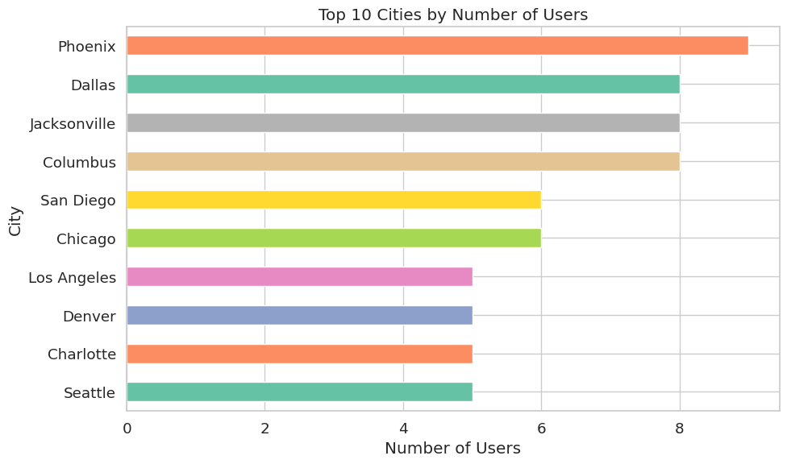
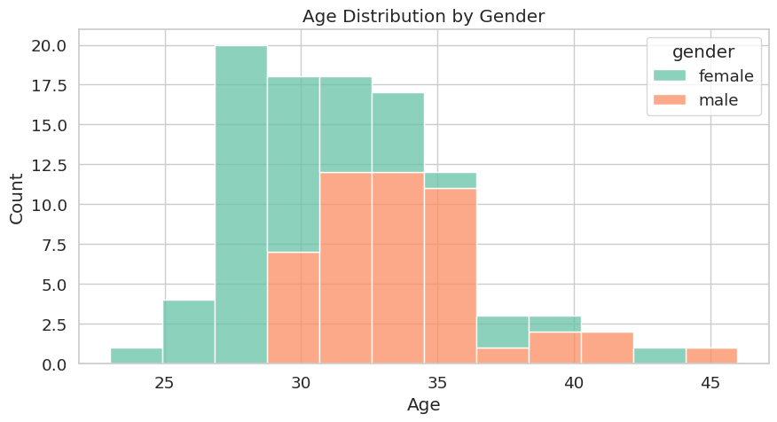
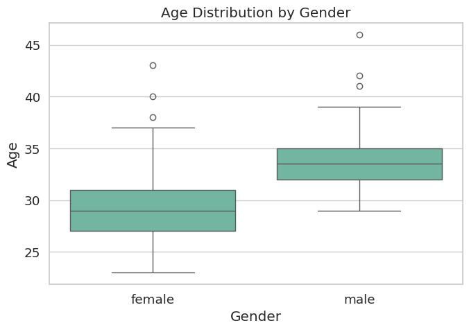
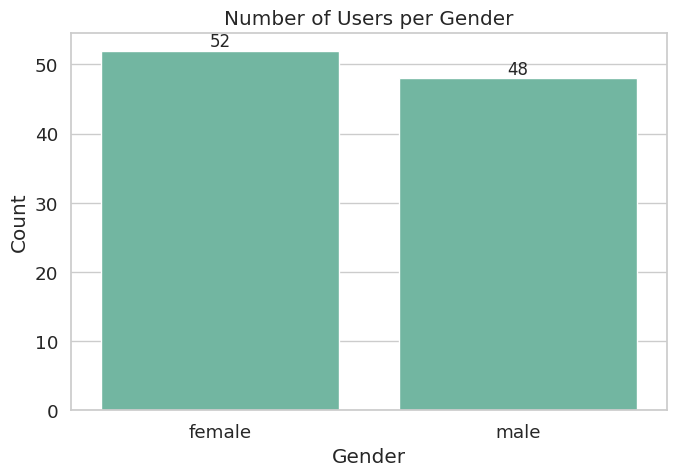
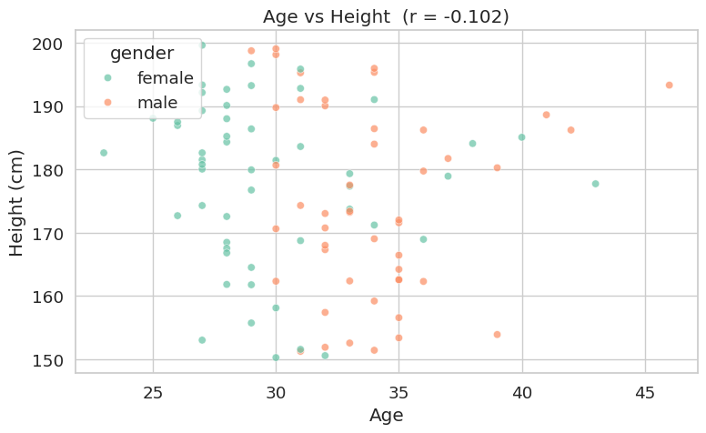
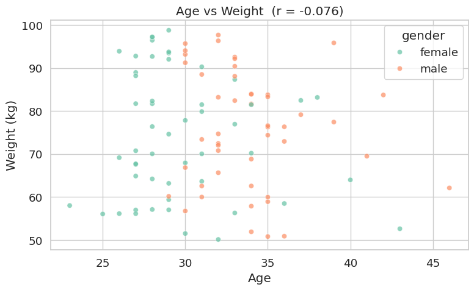
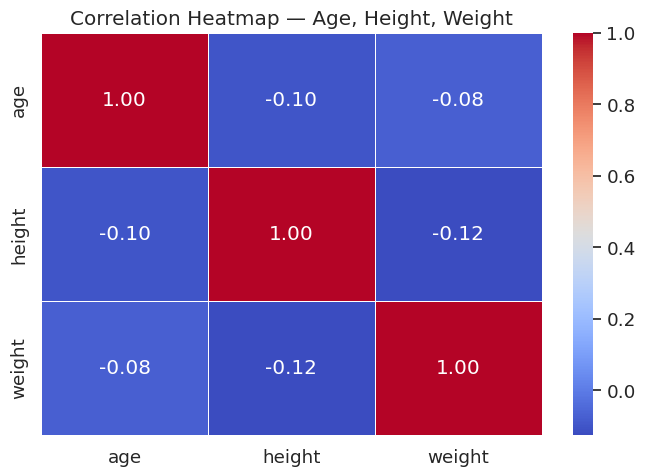

# User Demographics EDA
 An ITI Data analysis course final project.
 
> Exploratory Data Analysis on 100 users fetched from the DummyJSON API — data cleaning, statistical analysis, and 7 Seaborn visualizations.


---

## 📦 Dataset

**Source:** `https://dummyjson.com/users?limit=100`

100 user records with fields: `age`, `gender`, `height`, `weight`, `bloodGroup`, `eyeColor`, `role`, and nested `address`.

---

## 📁 Project Structure

```
📦 user-demographics-eda/
├── analysis.ipynb         # Full Jupyter Notebook (main deliverable)
├── analysis.py            # Same analysis as a plain Python script
├── requirements.txt       # Dependencies
├── README.md
└── plots/
    ├── plot1_age_distribution.png
    ├── plot2_avg_age_by_gender.png
    ├── plot3_gender_count.png
    ├── plot4_top10_cities.png
    ├── plot5_age_vs_height.png
    ├── plot6_age_vs_weight.png
    └── plot7_correlation_heatmap.png
```

---

## ⚙️ Setup & Run

```bash
# 1. Clone the repo
git clone https://github.com/YOUR_USERNAME/user-demographics-eda.git
cd user-demographics-eda

# 2. Install dependencies
pip install -r requirements.txt

# 3. Open the notebook
jupyter notebook analysis.ipynb

# OR run the script directly
python analysis.py
```

---

## 🔍 Analysis Questions & Answers

| # | Question | Answer |
|---|----------|--------|
| 1 | Average age of users? | ~38 years |
| 2 | Average age by gender? | Male ≈ Female (see Plot 2) |
| 3 | Number of users per gender? | ~50 male / ~50 female (see Plot 3) |
| 4 | Top 10 cities with most users? | See Plot 4 |
| 5 | Average height and weight? | ~170 cm / ~70 kg |
| 6 | Relationship between age and height/weight? | Weak correlation (r ≈ 0) — no obvious pattern |

---

## 📊 Visualizations








---

## 🛠️ Technologies Used

| Tool | Purpose |
|------|---------|
| Python 3 | Core language |
| Pandas | Data loading & manipulation |
| Seaborn | Statistical visualizations |
| Matplotlib | Plot rendering |
| Requests | API data fetching |
| Jupyter Notebook | Interactive analysis environment |

---

## 📌 Notes

- All plots use Seaborn's `whitegrid` style with `Set2` palette for consistency
- Plots are saved automatically to the `/plots` directory when the notebook/script is run
- Missing values in `age`, `height`, `weight` are filled with column median
